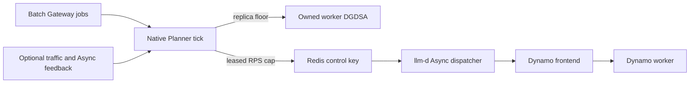

<!--
SPDX-FileCopyrightText: Copyright (c) 2025-2026 NVIDIA CORPORATION & AFFILIATES. All rights reserved.
SPDX-License-Identifier: Apache-2.0
-->

# Planner as a Batch Scheduler

## Planner Batch Scheduling POC

Batch Gateway remains the durable owner of jobs and results, llm-d Async remains
the request dispatcher, and Planner does not dispatch individual requests. Every
due native Planner tick observes durable job state plus optional
serving/dispatcher feedback and controls two generic outputs:

- a batch replica floor merged into Planner's normal final scaling decision;
- a renewable maximum batch-admission lease enforced by llm-d Async.



## Validation Evidence

Historical run `20260828T213549Z-planner-native-1e3ff8` began with the
worker DGDSA at zero and the existing frontend pod held SchedulingGated by
Grove/KAI. A new Gateway job caused Planner to keep admission at zero, scale
only the owned worker DGDSA `0 -> 1`, wait for readiness, open a 5-RPS cap,
drain 100/100 requests with zero failures, and return the batch floor and cap to
zero. The worker remained at one because the floor is a lower bound rather than
a scale-down instruction. See the
[native E2E report](experiment/reports/20260828-native-planner-e2e.md) and the
[experiment index](experiment/index.md) for the full evidence corpus.

That run predates this rebase, uses the older long worker name and Aug-28 image,
and is not evidence that the current head was rerun live. Current-head checks
are limited to unit/render/lint validation and the committed fixture-consistency
verifier described by the report.

The POC focuses on plumbing, fail-closed control, autonomous worker recovery,
and batch-only execution. Due-date optimization, concurrent online SLA
protection, fairness among jobs/tenants, and post-batch scale-down remain future
policy work.

The frontend counter used here measures requests accepted by the Dynamo handler;
it is an accepted-load proxy, not a measurement of all ingress attempts or
readiness/model rejections. This batch-only POC therefore does not establish
concurrent online SLA protection. That requires an ingress-attempt/rejection
signal. The preserved Async frontend-readiness queue gate and Planner's rollout
pause still prevent batch dequeue while the serving topology is unavailable.

The current public Batch Gateway list API is offset-paginated across all tenant
history and has no nonterminal snapshot filter. Planner therefore applies an
aggregate deadline plus page, job, and detail-concurrency bounds and rejects the
whole observation on truncation, timeout, duplicate IDs, or detail failure. That
is safety-correct for this bounded-history POC, but does not guarantee liveness
or snapshot completeness as terminal history grows or changes concurrently. A
production follow-up needs a dedicated active-job snapshot (or server-side
nonterminal filter backed by an active index) and stable snapshot/keyset cursor;
old Gateway versions silently ignore unknown query parameters.

Planner must be the exclusive writer of the configured drain-limit control key
and its derived `:planner-writer-fence` key. The epoch/sequence protocol fences
overlapping Planner instances, but a manual or external writer that ignores it
can still overwrite the control hash. Do not overlap the first rollout with a
legacy unfenced Planner writer. Redis Cluster deployments must place both keys
in one hash slot; the POC Valkey deployment is standalone. Advisory mode opens
only observation clients and performs no Redis bootstrap, renewal, or shutdown
pause.

The POC also CAS-claims the owned worker DGDSA and checks that writer annotation
with the DGDSA resourceVersion before every Scale PATCH. Its single Planner pod
must use the `Recreate` deployment strategy so an older process cannot fetch a
post-claim resourceVersion. This orders Redis admission and Kubernetes scaling
only for the one declared aggregate worker; it is not a generic multi-writer
transaction. Synchronous Kubernetes reads run off the Planner event loop but do
not yet have an aggregate client deadline. A stuck API call can therefore let a
lease expire and pause admission; it cannot extend admission beyond the lease.

## Deploy the Planner POC

First deploy the Batch Gateway example through the Async dispatch step in the
[parent README](../README.md), but set `FRONTEND_IMAGE` to an image built from
this branch before running its backend command. The parent recipe preserves a
pre-set value. The branch frontend is required because Planner anchors counter
reset detection on the new `process_start_time_seconds` metric. The worker may
remain on the compatible `vllm-runtime:1.5.0` image. The stock `dynamo.yaml`
remains independently deployable and does not create a Planner pod.

The stock Async deployment gates broker dequeue on the Dynamo frontend's
Prometheus readiness signal. The Planner overlay preserves that queue gate and
adds the companion LLM-180 Redis leased-rate gate at the worker-pool admission
boundary. Before starting Planner, use an Async image containing that gate and
apply the overlay. The v0.9.0 chart accepts image repository and tag separately,
so `ASYNC_IMAGE` must be a complete tagged image reference (digests and untagged
references are rejected here). Publish one-time, immutable tags for the Async,
frontend, and Planner images; `latest` and other moving tags make the captured
pod `imageID` the only useful content identity and are not acceptable for this
reproducibility recipe. This chart version cannot render digest references.

From `examples/deployments/llm-d-batch-gateway`, set the namespace and image,
split the image according to the chart schema, and render the exact Helm inputs:

```bash
export NAMESPACE=your-namespace
export BATCH_TENANT=planner-poc-baseline
export ASYNC_IMAGE=your-registry.example/llm-d-async:llm-180-immutable-build-id
export FRONTEND_IMAGE=your-registry.example/dynamo:planner-poc-immutable-build-id
export PLANNER_IMAGE=your-registry.example/dynamo:planner-poc-immutable-build-id

: "${NAMESPACE:?set NAMESPACE to the deployed example namespace}"
: "${BATCH_TENANT:?set BATCH_TENANT to the Batch Gateway tenant Planner observes}"
: "${ASYNC_IMAGE:?set ASYNC_IMAGE to the companion LLM-180 image}"
: "${FRONTEND_IMAGE:?set FRONTEND_IMAGE to a frontend image built from this branch}"
: "${PLANNER_IMAGE:?set PLANNER_IMAGE to a Planner image built from this branch}"

set -o pipefail

for IMAGE_REF in "${ASYNC_IMAGE}" "${FRONTEND_IMAGE}" "${PLANNER_IMAGE}"; do
  IMAGE_BASENAME="${IMAGE_REF##*/}"
  case "${IMAGE_REF}" in
    *@*)
      echo "image must use a tag, not a digest: ${IMAGE_REF}" >&2
      exit 1
      ;;
  esac
  if [[ "${IMAGE_BASENAME}" != *:* ||
        -z "${IMAGE_BASENAME##*:}" ]]; then
    echo "image must be a complete repository:tag reference: ${IMAGE_REF}" >&2
    exit 1
  fi
  case "${IMAGE_BASENAME##*:}" in
    latest|main|master)
      echo "use a one-time immutable image tag, not ${IMAGE_REF}" >&2
      exit 1
      ;;
  esac
done

ASYNC_IMAGE_REPOSITORY="${ASYNC_IMAGE%:*}"
ASYNC_IMAGE_TAG="${ASYNC_IMAGE##*:}"
if [[ "${ASYNC_IMAGE_REPOSITORY}" == "${ASYNC_IMAGE}" ||
      -z "${ASYNC_IMAGE_REPOSITORY}" ||
      -z "${ASYNC_IMAGE_TAG}" ||
      "${ASYNC_IMAGE_TAG}" == */* ]]; then
  echo "ASYNC_IMAGE must be a complete repository:tag reference" >&2
  exit 1
fi

ASYNC_VALUES_RENDERED="$(mktemp)"
PLANNER_MANIFEST_RENDERED="$(mktemp)"
trap 'rm -f "${ASYNC_VALUES_RENDERED}" "${PLANNER_MANIFEST_RENDERED}"' EXIT
envsubst '${NAMESPACE}' < llm-d-async-planner-values.yaml \
  > "${ASYNC_VALUES_RENDERED}"
if grep -Fq '${' "${ASYNC_VALUES_RENDERED}"; then
  echo "unresolved variable in rendered Async values" >&2
  exit 1
fi
if ! grep -Fq -- "namespace=\"${NAMESPACE}\"" \
  "${ASYNC_VALUES_RENDERED}"; then
  echo "Async readiness query does not target NAMESPACE exactly" >&2
  exit 1
fi

ASYNC_HELM_ARGS=(
  --version v0.9.0
  --namespace "${NAMESPACE}"
  --values llm-d-async-values.yaml
  --values "${ASYNC_VALUES_RENDERED}"
  --set-string "ap.image.repository=${ASYNC_IMAGE_REPOSITORY}"
  --set-string "ap.image.tag=${ASYNC_IMAGE_TAG}"
)

if ! ASYNC_RENDERED="$(helm template async-dispatch \
  oci://ghcr.io/llm-d/charts/llm-d-async \
  "${ASYNC_HELM_ARGS[@]}")"; then
  echo "failed to render the llm-d Async Planner deployment" >&2
  exit 1
fi

if ! grep -Fq -- \
  '--pool-config-file=/etc/llm-d-async/config/worker-pools.json' \
  <<<"${ASYNC_RENDERED}"; then
  echo "rendered Async deployment does not consume worker-pools.json" >&2
  exit 1
fi
if ! grep -Fq -- 'worker_pool_id\":\"dynamo-batch' \
  <<<"${ASYNC_RENDERED}"; then
  echo "rendered Async queue does not route to dynamo-batch" >&2
  exit 1
fi
if ! grep -Fq -- 'redis-leased-rate' <<<"${ASYNC_RENDERED}"; then
  echo "rendered Async worker pool does not use redis-leased-rate" >&2
  exit 1
fi
if ! grep -Fq -- 'prometheus-query' <<<"${ASYNC_RENDERED}" ||
   ! grep -Fq -- 'dynamo_frontend_model_ready' <<<"${ASYNC_RENDERED}"; then
  echo "rendered Async queue does not preserve frontend readiness gating" >&2
  exit 1
fi
if ! grep -Fq -- "image: \"${ASYNC_IMAGE}\"" <<<"${ASYNC_RENDERED}"; then
  echo "rendered Async deployment does not use ASYNC_IMAGE" >&2
  exit 1
fi
```

Only after all render checks pass, upgrade the existing Async release and
verify the live image, pool-config argument, and mounted gate configuration:

```bash
if ! helm upgrade --install async-dispatch \
  oci://ghcr.io/llm-d/charts/llm-d-async \
  "${ASYNC_HELM_ARGS[@]}" \
  --atomic \
  --wait \
  --timeout 5m; then
  echo "failed to deploy the llm-d Async Planner overlay" >&2
  exit 1
fi

if ! kubectl rollout status --namespace "${NAMESPACE}" \
  deployment/async-dispatch-llm-d-async \
  --timeout=180s; then
  echo "llm-d Async Planner rollout did not become ready" >&2
  exit 1
fi

DEPLOYED_ASYNC_IMAGE="$(kubectl get deployment \
  --namespace "${NAMESPACE}" \
  async-dispatch-llm-d-async \
  -o jsonpath='{.spec.template.spec.containers[0].image}')"
if [[ "${DEPLOYED_ASYNC_IMAGE}" != "${ASYNC_IMAGE}" ]]; then
  echo "live llm-d Async image does not match ASYNC_IMAGE" >&2
  exit 1
fi

ASYNC_PODS="$(kubectl get pods --namespace "${NAMESPACE}" \
  -l 'app.kubernetes.io/instance=async-dispatch,app.kubernetes.io/name=llm-d-async' \
  -o jsonpath='{range .items[*]}{.metadata.name}{"\t"}{.status.containerStatuses[0].ready}{"\t"}{.spec.containers[0].image}{"\t"}{.status.containerStatuses[0].imageID}{"\n"}{end}')" || exit 1
ASYNC_READY_POD="$(awk -F '\t' '$2 == "true" { print }' <<<"${ASYNC_PODS}")"
if [[ "$(awk 'NF { count++ } END { print count + 0 }' \
  <<<"${ASYNC_READY_POD}")" -ne 1 ]]; then
  echo "expected exactly one Ready llm-d Async pod" >&2
  exit 1
fi
IFS=$'\t' read -r ASYNC_POD _ ASYNC_POD_IMAGE ASYNC_IMAGE_ID \
  <<<"${ASYNC_READY_POD}"
if [[ "${ASYNC_POD_IMAGE}" != "${ASYNC_IMAGE}" || -z "${ASYNC_IMAGE_ID}" ]]; then
  echo "Ready Async pod lacks the expected image or resolved imageID" >&2
  exit 1
fi
printf 'Async image provenance: pod=%s ref=%s imageID=%s\n' \
  "${ASYNC_POD}" "${ASYNC_POD_IMAGE}" "${ASYNC_IMAGE_ID}"

ASYNC_ARGS="$(kubectl get deployment \
  --namespace "${NAMESPACE}" \
  async-dispatch-llm-d-async \
  -o jsonpath='{range .spec.template.spec.containers[0].args[*]}{.}{"\n"}{end}')" || exit 1
if ! grep -Fq -- \
  '--pool-config-file=/etc/llm-d-async/config/worker-pools.json' \
  <<<"${ASYNC_ARGS}"; then
  echo "live llm-d Async deployment does not consume worker-pools.json" >&2
  exit 1
fi
if ! grep -Fq -- 'worker_pool_id":"dynamo-batch' <<<"${ASYNC_ARGS}"; then
  echo "live llm-d Async queue does not route to dynamo-batch" >&2
  exit 1
fi
if ! grep -Fq -- 'dynamo_frontend_model_ready' <<<"${ASYNC_ARGS}" ||
   ! grep -Fq -- "namespace=\"${NAMESPACE}\"" <<<"${ASYNC_ARGS}"; then
  echo "live llm-d Async queue lacks the frontend readiness query" >&2
  exit 1
fi

ASYNC_POOL_CONFIG="$(kubectl get configmap \
  --namespace "${NAMESPACE}" \
  async-dispatch-llm-d-async-config \
  -o jsonpath='{.data.worker-pools\.json}')" || exit 1
if ! grep -Fq -- 'redis-leased-rate' <<<"${ASYNC_POOL_CONFIG}"; then
  echo "live llm-d Async worker pool does not use redis-leased-rate" >&2
  exit 1
fi
```

The POC overlay is an `envsubst` template because the Planner's service-account
subject, runtime namespace, and parent-DGD namespace must match the caller's
Kubernetes namespace. It also requires a Planner image built from this branch;
the template deliberately has no fallback image.

Confirm that the running branch frontend exposes Planner's process identity
anchor, then render, inspect, server-dry-run, and apply the Planner template:

```bash
FRONTEND_METRICS="$(kubectl get --raw \
  "/api/v1/namespaces/${NAMESPACE}/services/http:qwen3-0-6b-batch-frontend:8000/proxy/metrics")" || exit 1
if ! grep -Eq '^process_start_time_seconds [0-9]+([.][0-9]+)?$' \
  <<<"${FRONTEND_METRICS}"; then
  echo "frontend image does not expose process_start_time_seconds" >&2
  exit 1
fi

envsubst '${NAMESPACE} ${PLANNER_IMAGE} ${BATCH_TENANT}' \
  < planner-scheduling/planner-poc.yaml \
  > "${PLANNER_MANIFEST_RENDERED}"
if grep -Fq '${' "${PLANNER_MANIFEST_RENDERED}"; then
  echo "unresolved variable in rendered Planner manifest" >&2
  exit 1
fi
for EXPECTED in \
  'runtimeVersionOverride: "1.5.0"' \
  'nvidia.com/deployment-strategy: Recreate' \
  'qwen3-0-6b-batch-worker' \
  'llm-d-async:drain-limit:dynamo-batch'; do
  if ! grep -Fq -- "${EXPECTED}" "${PLANNER_MANIFEST_RENDERED}"; then
    echo "rendered Planner manifest is missing ${EXPECTED}" >&2
    exit 1
  fi
done
if ! grep -Fq -- "tenant: ${BATCH_TENANT}" "${PLANNER_MANIFEST_RENDERED}"; then
  echo "rendered Planner manifest does not target BATCH_TENANT exactly" >&2
  exit 1
fi
if ! kubectl apply --namespace "${NAMESPACE}" --dry-run=server \
  -f "${PLANNER_MANIFEST_RENDERED}" >/dev/null; then
  echo "Planner POC server dry-run failed" >&2
  exit 1
fi
if ! kubectl apply --namespace "${NAMESPACE}" \
  -f "${PLANNER_MANIFEST_RENDERED}"; then
  echo "failed to apply the Planner POC resources" >&2
  exit 1
fi
```

The overlay uses same-namespace service names for Batch Gateway, the Dynamo
frontend, llm-d Async metrics, and Valkey. Both the frontend and worker in the
stock backend mount the documented `model-cache` PVC at `HF_HOME=/opt/models`
and load `hf-token-secret`; create both resources in `NAMESPACE` before applying
`dynamo.yaml`.

Wait for the Planner's current generation (an older `Ready=True` condition is
not sufficient), then verify the actual Ready Planner and frontend pods,
resolved image IDs, namespaces, and least-privilege DGDSA permission:

```bash
PLANNER_DGD_READY=false
for _ in $(seq 1 150); do
  PLANNER_DGD_STATE="$(kubectl get dynamographdeployment \
    --namespace "${NAMESPACE}" qwen3-0-6b-batch-planner \
    -o jsonpath='{.metadata.generation}{"\t"}{.status.observedGeneration}{"\t"}{.status.conditions[?(@.type=="Ready")].status}')" || exit 1
  IFS=$'\t' read -r PLANNER_GENERATION PLANNER_OBSERVED PLANNER_READY \
    <<<"${PLANNER_DGD_STATE}"
  if [[ -n "${PLANNER_GENERATION}" &&
        "${PLANNER_GENERATION}" == "${PLANNER_OBSERVED}" &&
        "${PLANNER_READY}" == "True" ]]; then
    PLANNER_DGD_READY=true
    break
  fi
  sleep 2
done
if [[ "${PLANNER_DGD_READY}" != true ]]; then
  echo "Planner POC deployment did not become ready" >&2
  exit 1
fi

DEPLOYED_PLANNER_IMAGE="$(kubectl get dynamographdeployment \
  --namespace "${NAMESPACE}" \
  qwen3-0-6b-batch-planner \
  -o jsonpath='{.spec.components[0].podTemplate.spec.containers[0].image}')"
if [[ "${DEPLOYED_PLANNER_IMAGE}" != "${PLANNER_IMAGE}" ]]; then
  echo "live Planner image does not match PLANNER_IMAGE" >&2
  exit 1
fi

PLANNER_PODS="$(kubectl get pods --namespace "${NAMESPACE}" \
  -l 'nvidia.com/dynamo-graph-deployment-name=qwen3-0-6b-batch-planner,nvidia.com/dynamo-component=Planner' \
  -o jsonpath='{range .items[*]}{.metadata.name}{"\t"}{.status.containerStatuses[0].ready}{"\t"}{.spec.containers[0].image}{"\t"}{.status.containerStatuses[0].imageID}{"\t"}{.spec.serviceAccountName}{"\n"}{end}')" || exit 1
PLANNER_READY_POD="$(awk -F '\t' '$2 == "true" { print }' <<<"${PLANNER_PODS}")"
if [[ "$(awk 'NF { count++ } END { print count + 0 }' \
  <<<"${PLANNER_READY_POD}")" -ne 1 ]]; then
  echo "expected exactly one Ready Planner pod" >&2
  exit 1
fi
IFS=$'\t' read -r PLANNER_POD _ PLANNER_POD_IMAGE PLANNER_IMAGE_ID \
  PLANNER_SERVICE_ACCOUNT \
  <<<"${PLANNER_READY_POD}"
if [[ "${PLANNER_POD_IMAGE}" != "${PLANNER_IMAGE}" ||
      -z "${PLANNER_IMAGE_ID}" ||
      "${PLANNER_SERVICE_ACCOUNT}" != "planner-serviceaccount" ]]; then
  echo "Ready Planner pod lacks the expected image, imageID, or service account" >&2
  exit 1
fi

PLANNER_DEPLOYMENTS="$(kubectl get deployments --namespace "${NAMESPACE}" \
  -l 'nvidia.com/dynamo-graph-deployment-name=qwen3-0-6b-batch-planner,nvidia.com/dynamo-component=Planner' \
  -o jsonpath='{range .items[*]}{.metadata.name}{"\t"}{.metadata.generation}{"\t"}{.status.observedGeneration}{"\t"}{.spec.strategy.type}{"\t"}{.status.readyReplicas}{"\t"}{.spec.template.spec.serviceAccountName}{"\n"}{end}')" || exit 1
if [[ "$(awk 'NF { count++ } END { print count + 0 }' \
  <<<"${PLANNER_DEPLOYMENTS}")" -ne 1 ]]; then
  echo "expected exactly one generated Planner Deployment" >&2
  exit 1
fi
IFS=$'\t' read -r PLANNER_DEPLOYMENT PLANNER_DEPLOYMENT_GENERATION \
  PLANNER_DEPLOYMENT_OBSERVED PLANNER_DEPLOYMENT_STRATEGY \
  PLANNER_DEPLOYMENT_READY PLANNER_DEPLOYMENT_SERVICE_ACCOUNT \
  <<<"${PLANNER_DEPLOYMENTS}"
if [[ "${PLANNER_DEPLOYMENT_GENERATION}" != "${PLANNER_DEPLOYMENT_OBSERVED}" ||
      "${PLANNER_DEPLOYMENT_STRATEGY}" != "Recreate" ||
      "${PLANNER_DEPLOYMENT_READY}" != "1" ||
      "${PLANNER_DEPLOYMENT_SERVICE_ACCOUNT}" != "planner-serviceaccount" ]]; then
  echo "generated Planner Deployment is stale, not Ready/Recreate, or uses the wrong service account" >&2
  exit 1
fi

FRONTEND_SPEC="$(kubectl get dynamographdeployment \
  --namespace "${NAMESPACE}" qwen3-0-6b-batch \
  -o jsonpath='{.spec.components[?(@.name=="Frontend")].runtimeVersionOverride}{"\t"}{.spec.components[?(@.name=="Frontend")].podTemplate.spec.containers[0].image}')" || exit 1
IFS=$'\t' read -r FRONTEND_RUNTIME_VERSION DEPLOYED_FRONTEND_IMAGE \
  <<<"${FRONTEND_SPEC}"
if [[ "${FRONTEND_RUNTIME_VERSION}" != "1.5.0" ||
      "${DEPLOYED_FRONTEND_IMAGE}" != "${FRONTEND_IMAGE}" ]]; then
  echo "live frontend runtime/image does not match the branch deployment" >&2
  exit 1
fi

FRONTEND_PODS="$(kubectl get pods --namespace "${NAMESPACE}" \
  -l 'nvidia.com/dynamo-graph-deployment-name=qwen3-0-6b-batch,nvidia.com/dynamo-component=Frontend' \
  -o jsonpath='{range .items[*]}{.metadata.name}{"\t"}{.status.containerStatuses[0].ready}{"\t"}{.spec.containers[0].image}{"\t"}{.status.containerStatuses[0].imageID}{"\n"}{end}')" || exit 1
FRONTEND_READY_POD="$(awk -F '\t' '$2 == "true" { print }' <<<"${FRONTEND_PODS}")"
if [[ "$(awk 'NF { count++ } END { print count + 0 }' \
  <<<"${FRONTEND_READY_POD}")" -ne 1 ]]; then
  echo "expected exactly one Ready frontend pod" >&2
  exit 1
fi
IFS=$'\t' read -r FRONTEND_POD _ FRONTEND_POD_IMAGE FRONTEND_IMAGE_ID \
  <<<"${FRONTEND_READY_POD}"
if [[ "${FRONTEND_POD_IMAGE}" != "${FRONTEND_IMAGE}" ||
      -z "${FRONTEND_IMAGE_ID}" ]]; then
  echo "Ready frontend pod lacks the expected image or resolved imageID" >&2
  exit 1
fi

printf 'Planner image provenance: pod=%s ref=%s imageID=%s\n' \
  "${PLANNER_POD}" "${PLANNER_POD_IMAGE}" "${PLANNER_IMAGE_ID}"
printf 'Frontend image provenance: pod=%s ref=%s imageID=%s\n' \
  "${FRONTEND_POD}" "${FRONTEND_POD_IMAGE}" "${FRONTEND_IMAGE_ID}"

DEPLOYED_ROLE_NAMESPACE="$(kubectl get rolebinding \
  --namespace "${NAMESPACE}" \
  qwen3-0-6b-batch-planner-scaling-adapter \
  -o jsonpath='{.subjects[0].namespace}')"
if [[ "${DEPLOYED_ROLE_NAMESPACE}" != "${NAMESPACE}" ]]; then
  echo "Planner RoleBinding subject is in the wrong namespace" >&2
  exit 1
fi

CAN_PATCH_OWNED_ADAPTER="$(kubectl auth can-i patch \
  dynamographdeploymentscalingadapters.nvidia.com/qwen3-0-6b-batch-worker \
  --namespace "${NAMESPACE}" \
  --as "system:serviceaccount:${NAMESPACE}:planner-serviceaccount")" || exit 1
if [[ "${CAN_PATCH_OWNED_ADAPTER}" != "yes" ]]; then
  echo "Planner cannot CAS-patch its owned DGDSA writer fence" >&2
  exit 1
fi

CAN_SCALE_OWNED_ADAPTER="$(kubectl auth can-i patch \
  dynamographdeploymentscalingadapters.nvidia.com/qwen3-0-6b-batch-worker \
  --subresource=scale \
  --namespace "${NAMESPACE}" \
  --as "system:serviceaccount:${NAMESPACE}:planner-serviceaccount")" || exit 1
if [[ "${CAN_SCALE_OWNED_ADAPTER}" != "yes" ]]; then
  echo "Planner cannot scale its owned DGDSA" >&2
  exit 1
fi

PLANNER_CONFIG="$(kubectl get configmap \
  --namespace "${NAMESPACE}" \
  qwen3-0-6b-batch-planner-config \
  -o jsonpath='{.data.planner\.yaml}')" || exit 1
if ! grep -Fq -- "namespace: ${NAMESPACE}-qwen3-0-6b-batch" \
  <<<"${PLANNER_CONFIG}"; then
  echo "live Planner config targets the wrong runtime namespace" >&2
  exit 1
fi
```

## Optional POC Cleanup

Remove the Planner-only resources, then restore the stock Async image and
frontend-readiness gate without changing the rest of the Batch Gateway example:

```bash
kubectl delete --ignore-not-found --namespace "${NAMESPACE}" \
  dynamographdeployment/qwen3-0-6b-batch-planner \
  service/async-dispatch-llm-d-async-metrics \
  configmap/qwen3-0-6b-batch-planner-config \
  rolebinding/qwen3-0-6b-batch-planner-scaling-adapter \
  role/qwen3-0-6b-batch-planner-scaling-adapter

helm upgrade --install async-dispatch \
  oci://ghcr.io/llm-d/charts/llm-d-async \
  --version v0.9.0 \
  --namespace "${NAMESPACE}" \
  --reset-values \
  --values llm-d-async-values.yaml \
  --atomic \
  --wait \
  --timeout 5m
```

## Original design sketch

We will use Planner as a Batch Scheduler.

It will observe state like it does today, but may decide to dispatch a batch job instead of
make a scaling decision.

I.e. Planner can make predictions as to when is a good time to schedule a batch job vs autoscale.
For example, we may not have to autoscale if we are below our utilization (meeting SLA) but have enough batch work queued that we can
get done so that we do not have to pay the coldstart cost.

steady state -> some percentage below max utilization if know we have enough long term batch work.  steadily work through batch jobs. chunk up large batch jobs so that they are evenly distributed.
    short term traffic spike -> take a break from scheduling more batch work.
    short term traffic dip -> dispatch more batch work.
    long term traffic dip -> scale down
    long term traffic spike -> scale up
    giant batch job addition -> scale up
    small batch job addition -> scale down.

the calculus will look something like this.
Client schedules batch job with 20,000 requests and a DUE date of 1 hour from now.
Currently we are using 90% of capacity of the pool since the full pool can process 100 rps.
Meaning we can fit an actual 10 rps without violating SLAs.
So we start with a steady schedule of throwing 10rps.
Then we get to the point where we have a traffic spike, we need to stop the batch jobs.
The spike hit was 10% so we were able to survive it without autoscaling, but maybe lasted 50 mins.
So now we still have 10,0000 requests left but only 10 mins left.  so we need to scale up so we can handle 20rps extra.
And so we do that.  And everything meets SLA.  batch jobs and live traffic.

Obviously we can flesh out how that works but this is the basic idea.
Some big questions:

Should Planner basically just use the state of the batch jobs to determine whether it makes scaling decisions or not
and let router just handle scheduling of the batch job based on its SLA?

Planner knows what its planning for the size of the pool.
Case for Planner owning dispatching?
     it knows how much batch work a router should be taking and prioritizing.
     if router always prioritized by due date, then even when under utilized new requests will always cut in front of batch jobs.
Case for no?
    Router can just handle above as its own cost function.
    Planner just observes the actual batch job drain rate and scales based on that?
Case for a mix:
    1) to not overwhelm router anyway Planner will chunk.
    2) Planner will tune Router with an expected batch drain rate.
    3) Planner will change that drain rate as necessary
    4) Based on Routing decisions there may be a different effective batch drain rate.

Can we implement this with a customer Router policy class for batch tho?

POC Work:
1) Enable batch policy class / queue
2) If deficit round robin balancing exists today, we can use that?
3) For POC it might be easiest to just have Planner dispatch batch requests at a steady state: i.e. rate limited 10 RPS.
4) On LLM-D Gateway we would need to assess work - how to do partial batch job selection?
5) We will need plumbing of batch state to Planner
6) we will need to work on adding this to the Planner pipeline / brain.
7) We will need to add a testing setup and see how this works.
